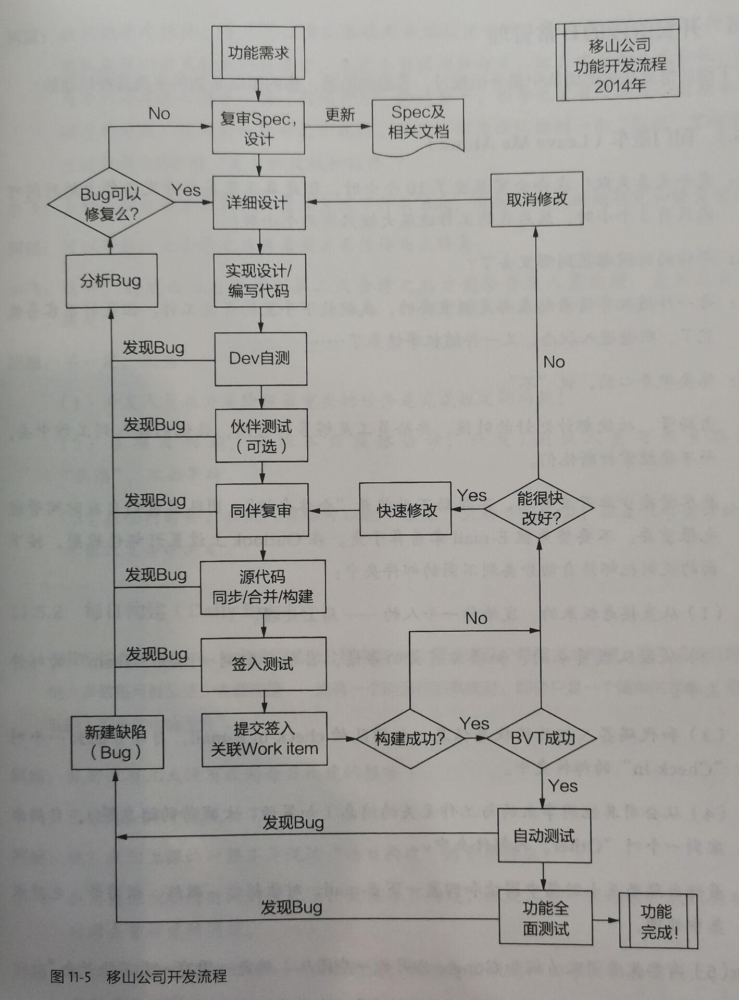

> 这篇文档是一篇用于快速入门软件工程的文档, 内容来自邹欣的*现代软件工程--构建之法*. 

[TOC]

基本观点: 

- 软件 == 程序 + 软件工程.

软件工程的目标是, 在一定约束条件下创造出足够好的软件. 

### 1. 个人开发

软件开发的基本单位是个人开发. 这里在编写代码外, 强调编写后的

- 单元测试: 为自己的模块写test case进行测试,
- 效能分析: 分析自己代码的效率.

#### 1.1 PSP

这里列出软件工程的To-do-list如下(CMU PSP 2.1)

Planning

- [ ] 明确需求, 时间成本和其它依赖

Development

- [ ] 分析需求, 生成设计文档
- [ ] 设计文档复审(和队友审核设计文档)
- [ ] 约定代码规范(为目前的开发制定合适的规范)
- [ ] 具体设计, 编写代码
- [ ] 代码复审
- [ ] 测试(自测, 修改代码, 提交修改)

Record Time Spent, Test Report, Size Measurement, 

Post-mortem

Process Improvement Plan

#### 1.2 一些开发中常见的误区

- 分析麻痹 | 想着先将开发中的所有细节, 依赖关系都弄清楚后再动手
- 不分主次 | 过于积极, 想马上动手修复所有主要和次要的依赖问题
- 过早优化 | 写程序时, 在某个局部的问题上陷进去, 花大量时间进行优化
- 过早泛化 | 程序具有扩展性, 但是不分主次, 不考虑难度对其进行扩展

[技能的反面](https://www.msra.cn/zh-cn/news/features/0b87da4c-979a-43d7-a2e2-20920e78a422) -> 需要先将低层次的操作变为类似于自动化过程后, 再去解决高层次的问题 -> No Silver Bullet. 

### 2. 两人合作

既然开始合作, 首先需要强调的是代码规范. 

#### 2.1 代码规范

代码规范分为两个部分

- 代码风格规范 | 文字上的规定, 
- 代码设计规范 | 程序设计, 模块之间的关系, 设计模式等. 

> 代码规范参考: https://zh-google-styleguide.readthedocs.io/en/latest/ 

#### 2.2 代码复审

代码复审 | 看代码是否在代码规范的框架内正确地解决了问题.

- 自我复审 | 用同伴复审的标准要求自己, 但不一定最有效, 因为过于自信
- 同伴复审 | 简便易行
- 团队复审 | 最严格的审核, 但效率可能不高

审核的目的在于

1. 发现代码的错误 e.g. 碰巧骗过编译器的错误, 不符合代码规范的地方
2. 发现逻辑的错误
3. 发现算法的错误 e.g. 算法不够优化, 边界条件没有处理好
4. 找出可能的需要改进的地方
5. 开发人员互相教育, 传授经验, 互相熟悉各自的代码和知识

审核的流程

1. 开发者在制定平台上成功编译代码, 
2. 开发者自行测试完成代码
3. 复审者复审, 对代码提出意见
4. 开发者逐一回应意见(打回去/ 有条件同意/ 同意)

审核的内容

摘要部分

- [ ] 代码符合需求和规格说明吗?
- [ ] 代码设计是否考虑周全?
- [ ] 代码的可读性如何?
- [ ] 代码容易维护吗?
- [ ] 代码的每一行都执行并检查过了吗?

设计规范部分

- [ ] 设计是否遵循项目设计规范?
- [ ] 代码是否有依赖于某种硬件, 对将来移植性的影响如何?
- [ ] 是否有无用的代码可以清楚?

代码规范部分

- [ ] 代码是否符合团队的代码的风格和标准?

具体代码部分

- [ ] 有没有对错误进行处理? 调用的外部函数, 是否检查了返回值或处理了异常?
- [ ] 参数传递有无错误, 字符串的长度是字节的长度还是字符(可能是单/双字节)的长度, 是以0开始计数还是以1开始计数?
- [ ] 边界条件是如何处理的? switch语句的default分支是如何处理的? 循环有没有可能出现死循环?
- [ ] 对资源的利用, 是在哪里申请的, 在哪里释放的? 有无可能存在的资源泄露(内存, 文件, 各种GUI资源, 数据库访问的连接, ...)? 有没有优化的空间?
- [ ] 数据结构中有没有用不到的元素?

效能

- [ ] 代码的效能(Performance)如何? 最坏的情况是怎样?
- [ ] 代码中, 特别是循环中是否有明显可优化的部分(C++中反复创建类, ...)?
- [ ] 对于系统和网络的调用中是否可能会超时? 怎么处理?

可读性

- [ ] 代码可读性如何? 有没有足够的注释?

可测试性

- [ ] 对于新的代码, 是否需要更新或者创建新的单元测试? 

### 3. 团队开发

这里从宏观上讲团队合作开发. 

#### 3.1 多人开发流程

> 因为auto-Car-a_safe_drive项目是较为传统的嵌入式项目, 这里只介绍RUP.

RUP将软件开发分为几个阶段, 一个大的阶段结束称为一个里程碑. 每个阶段内可以有几个迭代, 以比较灵活的方式实现本阶段的任务. 

- 初始阶段 | 分析软件系统的大概构成, 系统与外部系统的边界在哪里(我们的系统究竟和什么别的外部实体打交道), 大致的成本和预算是多少, 系统的风险主要来自哪里. 

  成功度过初始阶段的项目会达到**生命周期目标**里程碑. 

- 细化阶段 | 它的目标是分析问题领域, 建立健全的体系结构基础, 编制项目计划, 按优先级处理项目中的风险. 团队要确定项目的具体范围, 主要功能, 性能, 安全性, 可扩展性等非功能性的需求. 同时为项目建立支持环境, 包括创建开发案例, 创建模板并准备工具. 

  细化阶段结束后项目达到第二个里程碑, **生命周期结构**里程碑.

- 构造阶段 | 这一个阶段中, 团队开发出所有的功能, 并且有秩序地把功能集成为经过各种测试验证过的版本. 

  构造阶段结束时是第三个重要的里程碑, **初始功能**里程碑. 此时版本称为beta版本. 

- 交付阶段 | 此时, 团队工作的重点是确保软件能够满足最终用户的实际需求. 交付阶段有迭代(beta1, beta2等), 基于用户的反馈, 团队利用这些迭代对系统进行修改, 调整. 除了对功能的调整, 团队还要注意处理用户设置, 安装和可用性等问题. 

  在交付阶段的终点是第四个里程碑, **产品发布**里程碑.

#### 3.2 开发流程

### 4. 版本控制工具

开发中会遇到很多的版本, 这里引入版本控制工具Git, 并使用GitHub托管项目代码. 